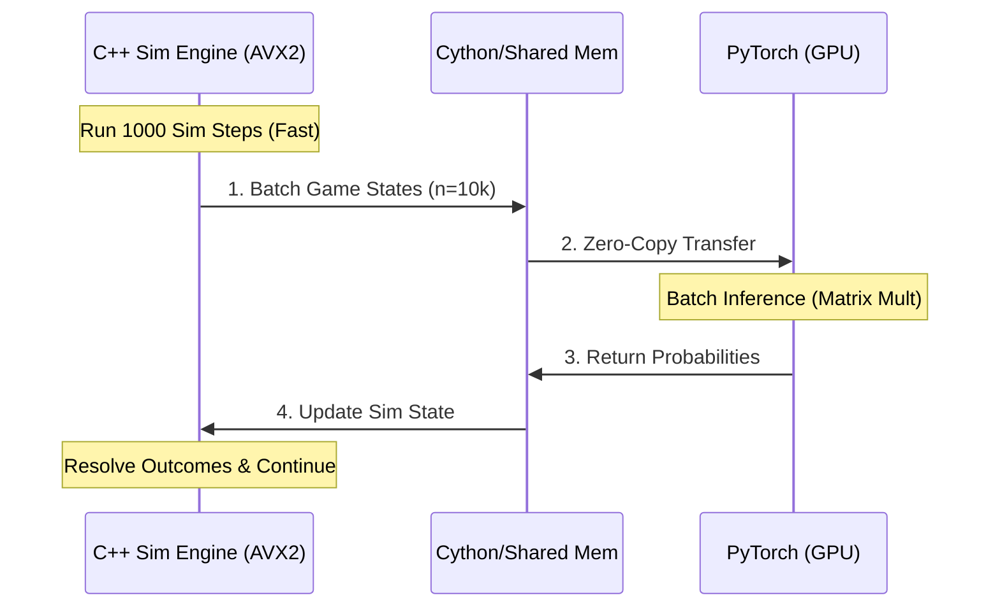
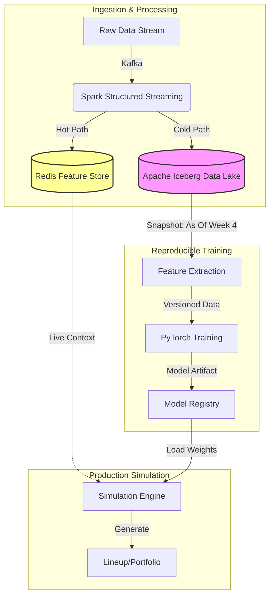
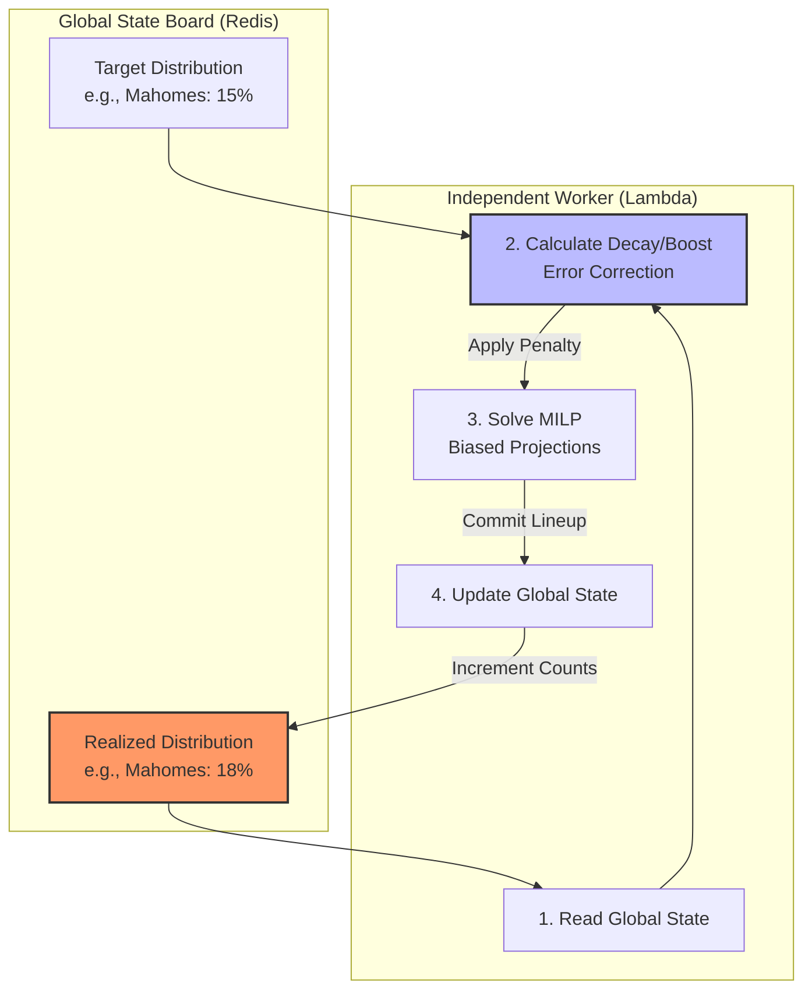

TECHNICAL OVERVIEW: ML INFRASTRUCTURE PROJECT
Jamey Steed | 2022-Present

## Project Summary

I built an end-to-end machine learning system for sports prediction and portfolio optimization that generated over \$1M in profit from \$3K initial capital. The system combines PyTorch-based neural network training, GPU-accelerated inference, distributed compute infrastructure, and real-time data pipelines.

This overview focuses on the ML infrastructure components most relevant to production training and inference systems.

## ML Training Infrastructure

### Model Architecture & Training Pipeline

I designed and operated PyTorch training pipelines for multiple supervised learning models across different sports domains (NFL, MLB, NBA, etc.):

**Outcome Prediction Models:**
- Built neural networks to predict play-level and drive-level outcomes in NFL games given game state (down, distance, field position, score, time remaining)
- Trained on ~250K historical plays with ~500K feature rows (multiple players per play)
- Similar architectures adapted for MLB (pitch outcomes, at-bat results) and NBA (possession outcomes)

**Surrogate Models:**
- Trained MLP-based models to approximate simulation-derived metrics (expected value, variance, tail risk)
- These served as fast, differentiable approximations of expensive Monte Carlo simulations
- Enabled gradient-based optimization without rerunning full simulations

**Example Model (NFL) & Promotion Criteria**

To make the modeling approach concrete, the core NFL model was a play-by-play predictor. Each row represented a single
play with ~200 engineered features describing game context (score, clock, field position, team/player info & tendencies, etc.)

**Model architecture**

The multi-head architecture produced probability distributions. Each head's output was a PMF or parametric distribution that the Monte Carlo engine sampled from
- **Play Type Head** - Categorical PMF over run/pass/punt/FG/sack/other
- **Target Head** - Categorical PMF over receiving/rushing targets (e.g. "pass to AJ Brown") for applicable play types
- **Outcome Complex** - A composite head producing the sequential conditional distributions of the play's result. It outputs:
  - Result: Categorical PMF (completion, interception, incompletion, fumble, etc.)
  - Yardage: Parametric distribution for yards gained/lost
  - Time: Parametric distribution for clock usage

During simulation, the C++ engine performed **Inverse Transform Sampling** on these distributions in dependency order:
1. Sample play type
2. Select the corresponding Target distribution and sample
3. Sample the Outcome (e.g. "Completion) and then sample yardage/time from their respective distributions.

This allowed the downstream simulator to capture
the **full variance and correlation structure** of real gameplay rather than relying on mean predictions or deterministic
rollouts.

Predicting only the mean yardage or mean time usage produces unrealistic simulations (no explosive plays, no variance in clock usage)
By sampling from the full predicted distribution for each play component, the MC engine preserved tail behavior, variance,
and negative/positive correlations across play components. These are all essential for realistic outcome modeling.

Approximate architecture details:
- Trunk: 3 fully-connected layers (512 -> 256 -> 128), ReLU activations
- Regularization: dropout (p ~ 0.1-0.2) and weight decay
- Heads: small 1-2 layer MLPs branching from the shared trunk
- Optimizer: Adam (lr ~ 1e-3), cosine schedule, batch size 1024-4096

**Use in Simulation**
All heads produced distributions and the MC simulator *sampled* from each of them during rollout:
- The simulator drew a play type -> target -> outcome -> yards -> time
- Each draw conditioned the next state (field position, clock, score, etc.)
- This allowed downstream lineups to capture extreme plays, realistic variance, and meaningful interactions between components.

Predicting means only would collapse variance and eliminate explosive plays, turnovers, and realistic clock dynamics. Sampling from full predicted distributions preserved
tail behavior, realistic volatility, and non-linear effects essential for lineup-level EV modeling.

**Promotion Criteria**
A model was only promoted if:
1. Primary losses (cross-entropy/MAE) improved on the validation season,
2. Calibration improved (ECE, Brier), and
3. Simulation-level metrics were equal or better than the current model.

All model versions were tied to an Iceberg snapshot, Git commit, and YAML config to ensure reproducibility.

**State Space Quantization**: Implemented a semantic bucketing strategy to map continuous game states into discrete
"similarity buckets." This allowed the inference engine to cache and reuse probability distributions for logically similar scenarios,
increasing cache hit rates and effectively decoupling simulation throughput form model inference latency.

### Training Infrastructure

**GPU Acceleration:**
- Primary development on NVIDIA GTX 1660 Ti (6GB VRAM) [note: this is just the GPU I already owned, didn't need more]
- Scaled to AWS EC2 g4dn instances (T4 GPUs) for larger hyperparameter sweeps
- Typical training cycles: 20-40 minutes per model
- Used mixed-precision training where applicable to maximize GPU utilization

**Experiment Tracking & Versioning:**

I built a lightweight but structured experiment tracking system:
- Versioned model artifacts in directories like `models/play_model/2024_wk12/`
- Logged hyperparameters, training curves, validation metrics, and feature schemas in YAML
- Saved training/validation loss plots automatically for each run
- Implemented model checkpointing with best-model selection based on validation performance

**Reproducibility:**
- Data versioning through Iceberg table snapshots enabled reproducible experiments
- Feature schema versioning ensured consistency between training and inference
- Every model included metadata about training data timespan and feature set
- Could roll back to any previous model version with full lineage

### Training Workflow

1. Feature engineering jobs populate versioned Iceberg tables
2. Training script reads from specific table snapshot
3. Model trained on GPU with automatic checkpointing
4. Validation metrics logged and compared to previous versions
5. Best model promoted to "current" via config update
6. New model automatically picked up by inference pipeline

## GPU-Accelerated Inference Infrastructure

### Batch Inference System

I built a high-throughput batch inference system that processes 100K+ candidate evaluations per run:

**Architecture:**
- Load PyTorch models directly into GPU memory at pipeline startup
- Maintain all intermediate tensors on GPU (game states, player projections, lineup matrices)
- Process evaluations in large batches (typically 1K-10K at a time) to maximize GPU utilization

**Performance Optimization:**
- Batched matrix multiplications for lineup scoring across thousands of candidates
- GPU-accelerated top-k operations for ranking and selection
- Achieved 10-100x speedup over CPU-based evaluation depending on batch size
- Kept GPU utilization high (>80%) during evaluation phases

**Model Deployment:**
- Models loaded from versioned artifact directories at pipeline initialization
- Version controlled via config file (e.g., `models/play_model/current → 2024_wk12`)
- Rollback capability: simply update config pointer to previous version
- No downtime required - next pipeline run picks up new model

### Integration with Simulation

The inference system integrated tightly with my Monte Carlo game simulators:
- Neural networks called within game simulation loops to predict play outcomes
- Batched evaluation across hundreds of parallel game simulations
- Lineup utility models scored thousands of candidates across simulated scenarios
- All GPU-accelerated to maintain throughput

## Feature Engineering & Data Pipeline

### Data Architecture

I built a Kafka → Spark → S3/Iceberg pipeline for ML feature engineering:

**Streaming Ingestion:**
- Kafka consumers ingest real-time data (game events, player updates, line movements)
- Structured as Avro messages with schema registry
- Multiple topics for different data sources

**Batch Processing:**
- PySpark jobs transform raw events into ML features
- Time-partitioned Parquet files in S3
- Managed via Apache Iceberg for ACID transactions and schema evolution
- ~700GB total data lake across all sports

**Feature Store Pattern:**
- Historical features: pre-computed and stored in Iceberg tables
- Real-time features: computed on-demand from recent Kafka events
- Feature versioning: schema evolution tracked, old versions readable
- Reproducibility: Iceberg snapshots enable training on exact historical state

### Data Quality

- Automated validation checks on ingested data (schema compliance, range checks, anomaly detection)
- Pipeline monitoring via CloudWatch with alerts on data freshness and volume
- Recovery mechanisms for failed jobs (idempotent processing, checkpointing)

## Distributed Compute Infrastructure

### Optimization System

For computationally intensive optimization, I built a distributed MILP solver:

**Architecture:**
- **AWS Lambda fan-out pattern** with 1000+ concurrent workers
- **Shared Stateboard (Redis):** Implemented a cooperative optimization pattern. Workers read global constraints (e.g. exposure counts)
in real-time and adaptively bias their local MILP solver
- **Synthetic Population Generation:** Workers coordinate to ensure the final set of generated lineups converges to a
target statistical distribution (the "projected field")

**Performance:**
- Reduced solve time from 12+ hours (single machine) to 3-5 minutes (distributed)
- Elastic scaling: automatically adjusts worker count based on problem size
- Fault tolerance: failed workers automatically retried with exponential backoff

### Performance Engineering in C++

For the core Monte Carlo simulation engine, I rewrote performance-critical components in C++:

**Optimizations:**
- Multithreaded design with lock-free data structures where possible
- Cache-efficient memory layouts for hot paths
- SIMD intrinsics for vectorizable operations
- Achieved ~9x speedup over equivalent Python implementation

**Memory Efficiency:**
- Streaming processing for billion-scale computations within 4GB RAM constraints
- Chunked processing with strategic caching
- One optimization reduced memory footprint from 71GB → <1GB through chunked Cython + POSIX threads and made a
previously impossible operation possible

## Production Operations

### Monitoring & Reliability

Operated 10+ daily production pipeline components:
- ETL jobs (Spark-based feature engineering)
- Streaming consumers (Kafka → processing → storage)
- Training pipelines (scheduled retraining)
- Inference/simulation pipelines (contest evaluation)
- Optimization jobs (portfolio generation)

**Monitoring:**
- CloudWatch metrics and alarms for all critical jobs
- Custom validation checks (data freshness, volume anomalies, output quality)
- Automated alerts on failures with detailed error context

**Recovery:**
- Idempotent job design enables safe retries
- Checkpointing for long-running jobs
- Automated recovery for transient failures
- Manual intervention protocols for data quality issues

### Deployment & Version Control

- Infrastructure as code using Terraform
- Model versioning through artifact directories + config pointers
- Data versioning through Iceberg snapshots
- Blue/green deployment not required due to batch processing nature

## Technical Stack Summary

**ML & Inference:**
- PyTorch for training and inference
- CUDA/GPU acceleration (GTX 1660 Ti, AWS T4)
- NumPy, Pandas for data manipulation
- Scikit-learn for baseline models
- OR-Tools for optimization

**Data Infrastructure:**
- Apache Kafka for streaming ingestion
- PySpark for batch processing
- Apache Iceberg for data lake management
- S3 for storage
- PostgreSQL for metadata

**Compute Infrastructure:**
- AWS Lambda for distributed compute
- AWS EC2 for GPU workloads
- Redis for coordination
- Docker for containerization

**Operations:**
- Custom orchestration + AWS Step Functions
- CloudWatch for monitoring
- Terraform for infrastructure
- Git for version control

## Key Takeaways for ML Infrastructure

This project demonstrates several production ML infrastructure patterns:

1. **Full ML Lifecycle:** Training → validation → serving → monitoring all implemented
2. **GPU Optimization:** Both training and inference optimized for GPU throughput
3. **Versioning & Reproducibility:** Models, data, and features all versioned for reproducibility
4. **Production Operations:** Monitoring, alerting, recovery mechanisms for reliability
5. **Performance Engineering:** Willing to drop to C++ when Python performance insufficient
6. **Distributed Systems:** Built scalable compute infrastructure (Lambda fan-out, Kafka/Spark)
7. **Multi-Domain:** Same infrastructure patterns applied across NFL, MLB, NBA domains

The system ran in production for 3+ years, processing millions of predictions per week with high reliability.

## What I'd Like to Learn

While I've built this system at single-GPU scale, I'm excited to scale up to production multi-GPU distributed training environments:

- Multi-node distributed training (PyTorch DDP, FSDP)
- Ray ecosystem (Ray Train, Ray Serve)
- Advanced inference optimization (TensorRT, Triton Inference Server)
- Training on 100+ GPUs with gradient synchronization and communication optimization
- Building infrastructure that supports multiple research teams with diverse needs

I have strong fundamentals in distributed systems, GPU optimization, and production operations - ready to apply these to larger-scale ML training infrastructure.